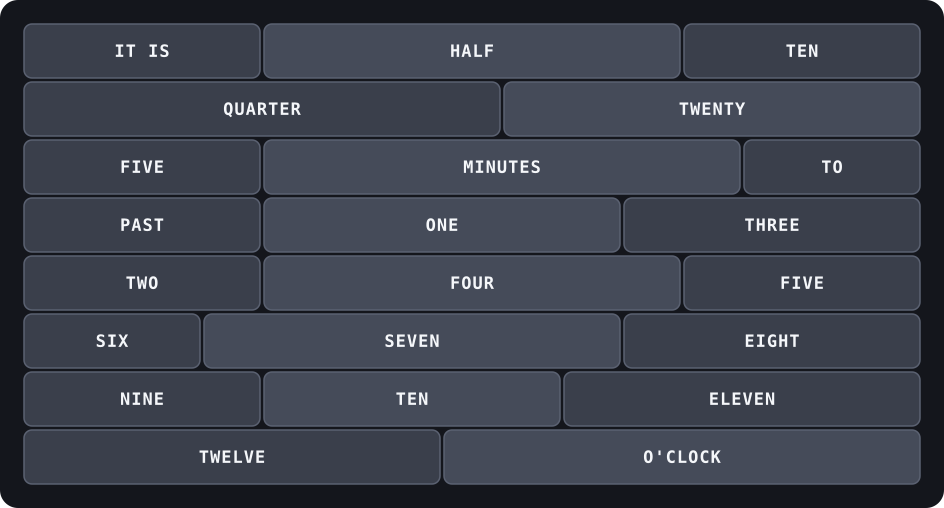

# word-clock

WS2812-based word clock running on a Seeed XIAO ESP32-C3, built with
PlatformIO + Arduino framework.

## Face layout



The clock reads "IT IS [minutes] [PAST/TO] [hour] O'CLOCK", e.g. "IT IS TEN
MINUTES PAST TWELVE" or "IT IS QUARTER TO THREE". This diagram shows word
placement, not physical wiring order — the LED strip is a single serpentine
run that starts at the bottom-left row and snakes upward, alternating
direction each row (see `stripIndex()` in `src/words.cpp`).

## Setup

1. Install [PlatformIO](https://platformio.org/install) (VS Code extension
   or CLI: `pip install platformio` / `brew install platformio`).
2. Copy `include/config.example.h` to `include/config.h` (already done, and
   gitignored) and fill in your WiFi credentials, timezone, and LED pin/count.
3. Build and flash:
   ```sh
   pio run -t upload
   pio device monitor
   ```

## Project layout

- `src/main.cpp` — WiFi connect, NTP time sync, main render loop.
- `src/words.cpp` / `include/words.h` — maps a time to the set of LED pixels
  that spell it out, using each word's (row, column) position in the text
  grid, translated to the physical serpentine wiring index.
- `include/config.h` — WiFi/NTP/LED settings (gitignored, not committed).

## Hardware

- Board: Seeed XIAO ESP32-C3
- LEDs: WS2812B addressable strip/matrix wired into the word grid
- Data pin, LED count, and brightness are set in `include/config.h`
